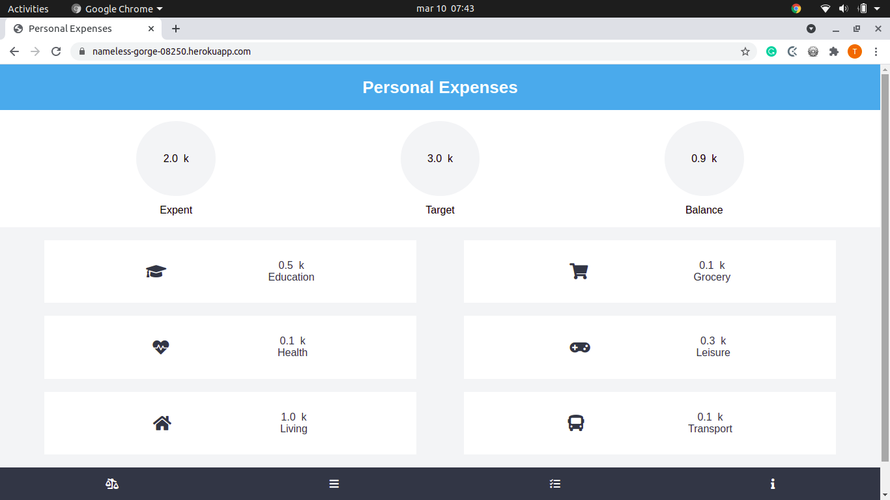

# Final Capstone

#### Hello there! Welcome to Personal Expenses, your personal expenses managing application. The purpose of this project is to help people managing their expenses and achieving their personal financial goals.

##### This is a front-end application, which retrieves data from [this API](https://github.com/tadeuasarro/track-api/tree/milestone7) that I developed.

#### Features
- Register and login using only the username
- Create and reset goals of how much money the user plans to expend
- Track expenses and sort them into six different categories
- Check a dashboard which summarizes the expenses into the categories
- Check the history log which displays the expenses info

#### Screenshot



#### Livedemo

- [Heroku](https://nameless-gorge-08250.herokuapp.com/)

## Built With

- [React](https://reactjs.org/)
- [Redux](https://redux.js.org/)

## Packages
- [Eslint](https://eslint.org/)
- [PropTypes](https://www.npmjs.com/package/prop-types)
- [React-dom](https://www.npmjs.com/package/react-dom)
- [React-router-dom](https://www.npmjs.com/package/react-router-dom)
- [React-test-renderer](https://www.npmjs.com/package/react-test-renderer)
- [Redux-thunk](https://www.npmjs.com/package/redux-thunk)
- [Stylelint](https://stylelint.io/)
- [Webpack](https://webpack.js.org/)

## Getting started

### Setup

Clone the repo with

```
  https://github.com/tadeuasarro/track-app.git
```

Install packages with

```
  npm install
```

Start server with:

```
  npm start
```

Follow the instructions in [this repo](https://github.com/tadeuasarro/track-api/tree/milestone7) to start the local server.

Open `http://localhost:3000/` in your favorite browser.

### Run tests

```
  npm test
```


### Using

- The first time you access the app you will have to create a username.

- The next time you can login using that username.

- Before adding expenses the application will require you to create a target.

- After that all you have to do is add the expenses and you can check them out in the home and progress tabs.

### Authors

👤 This is me:

- [Tadeu A Sarro](https://tadeuasarro.me)


### Contributing

Contributions, issues and feature requests are welcome!

Feel free to check the [issues page](https://github.com/tadeuasarro/track-app/issues)


### Show your support

Give a star if you like this project!

### Acknowledgments

- [Track-API](https://github.com/tadeuasarro/track-api/tree/milestone7)
- [Microverse](https://www.microverse.org/)

### 📝 License

This project is MIT licensed.